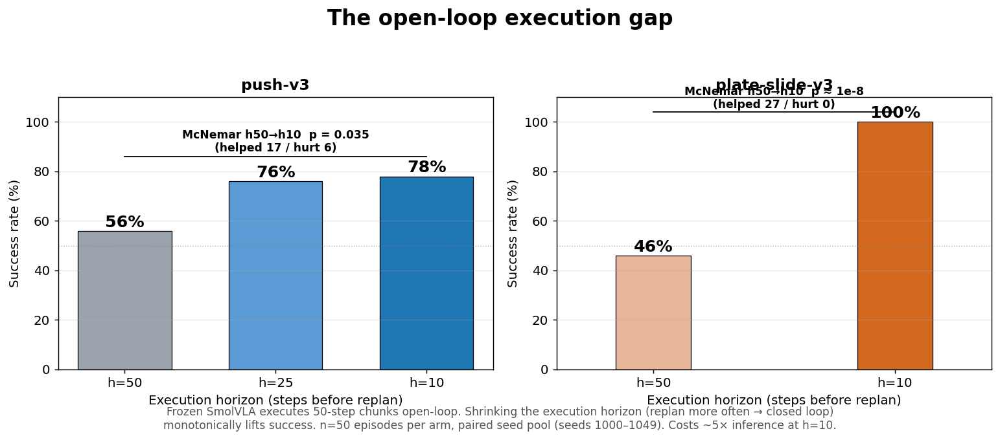
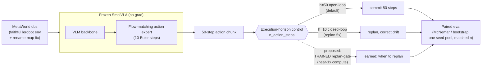
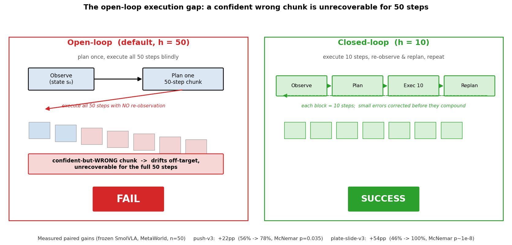
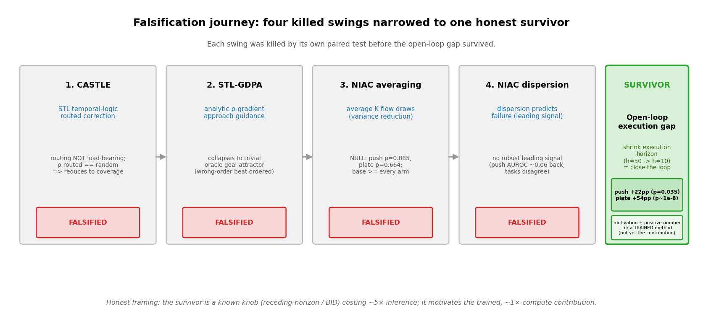
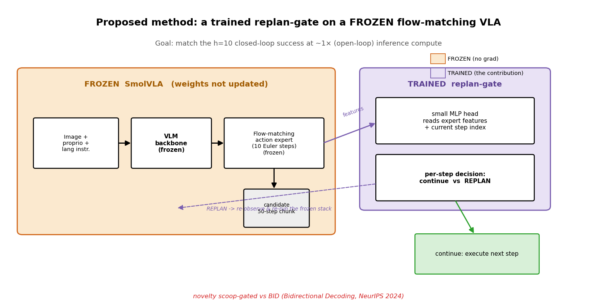
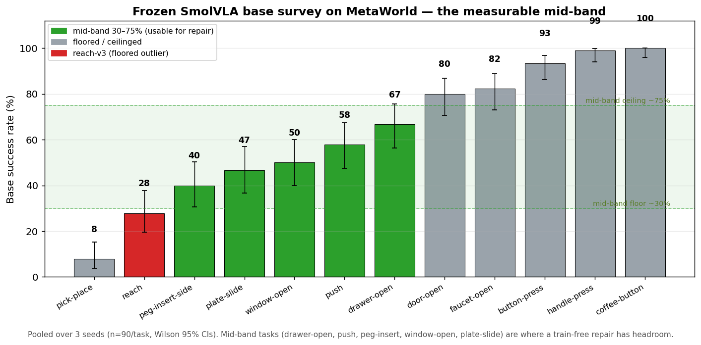
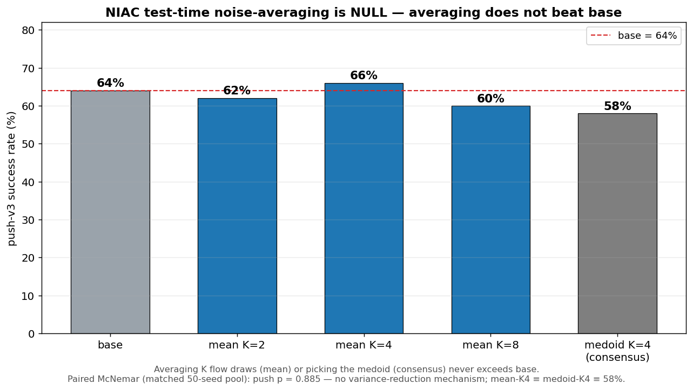
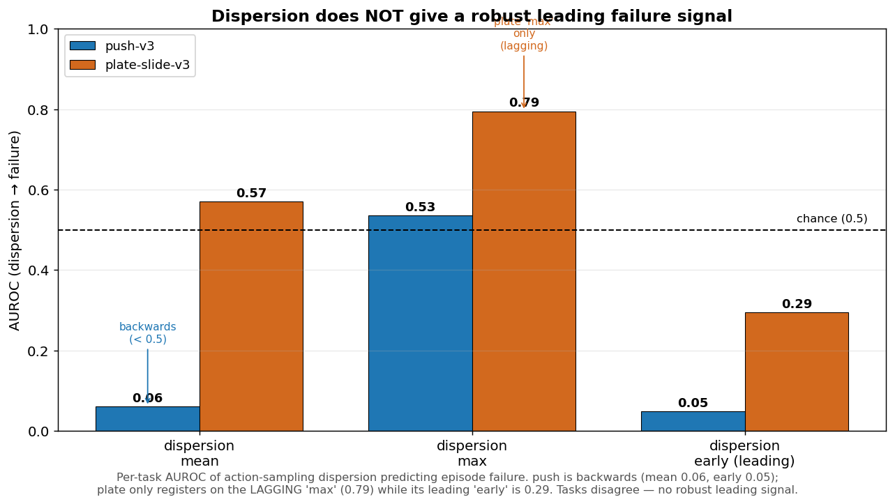

# Horizon — Closing the Loop on Frozen Flow-Matching VLAs

*A frozen SmolVLA flow-matching policy fails on MetaWorld by **confidently committing** to a 50-step action chunk it cannot take back. Close the execution loop and it recovers.*

**TL;DR.** There is a real, verified, **paired** positive anchor here: shrinking a frozen SmolVLA's execution horizon (replanning more often → closed loop) lifts push-v3 from 56% → 78% and plate-slide-v3 from 46% → 100% on a single matched seed pool. But that knob is **already known** — closing the loop more often is plain receding-horizon / temporal ensembling, and the test-time chunking literature (Bidirectional Decoding, Real-Time Chunking) already exploits chunk overlap — and it costs **~5× inference**, so it is the *motivation*, not the contribution. The proposed **contribution** is a **trained, lightweight adaptive replan-gate** on the frozen flow-matching VLA that decides **when** to replan, recovering the closed-loop success at near-1× compute. Novelty is **thin but present**: the nearest *trained* neighbor is **DCDP** (arXiv:2603.01953), which corrects the *actions* via learned dynamics features — Horizon's gate instead decides replan *timing*. The honest bar is that the learned gate must **beat fixed-frequency replanning at a matched replan budget** (smarter *when*, not just *more often*); if it only ties, it collapses to the known knob.

---

## The result



SmolVLA executes 50-step action chunks **open-loop** (`n_action_steps=50`). Shrinking the execution horizon — replanning more often, i.e. closing the loop — gives a large, **paired**, replicated gain that is **monotone in horizon**:

| task | h=50 (default, open-loop) | h=25 | h=10 (closed-loop) | paired McNemar (h50→h10) |
| --- | --- | --- | --- | --- |
| **push-v3** | 56% | 76% | **78%** (+22pp) | helped 17 / hurt 6, **p = 0.035** |
| **plate-slide-v3** | 46% | — | **100%** (+54pp) | helped 27 / hurt 0, **p ≈ 1e-8** |

n = 50 episodes per arm, **single matched seed pool** (seeds 1000–1049). The comparison is paired (same seeds across horizons) and tested with McNemar — *not* unpaired overlapping confidence intervals (see [the research journey](#the-honest-research-journey) for why that distinction is load-bearing).

---

## What this is

Horizon is a **faithful** frozen-SmolVLA × MetaWorld harness plus the evidence and a proposal whose novelty is **thin but present** (differentiated against the four nearest papers — DCDP, BID, RTC, Legato — see [docs/PROPOSAL.md](docs/PROPOSAL.md)). Nothing here modifies the base weights (the one exception, `finetune_smolvla.py`, trains the action expert only and is the *proposed-method scaffold*, not the baseline).



---

## Why it works (mechanism)



The base fails by **confident open-loop commitment**. A 50-step chunk is executed with **no re-observation** for 50 steps; a chunk that is confident-but-wrong drifts off target and is **unrecoverable for the full chunk**. Closing the loop (replan every 10 steps) lets the policy re-observe and correct small errors *before* they compound — which is exactly the [paired gain above](#the-result).

This is supported by the **dispersion evidence**: on push-v3, **FAILED** episodes show **lower** action-sampling diversity than **SUCCESSFUL** ones (AUROC **0.94** in the success direction). The base does not fail by dithering — it fails by committing confidently to the wrong plan. (Note this is a *property of failures*, not a usable *leading predictor* — see [dispersion](#evidence--reproducibility) below.)

---

## The honest research journey



Horizon is the survivor of **four falsified swings**. Each was killed by its own paired test before the open-loop gap survived:

1. **CASTLE** — STL-temporal-logic-routed correction. Routing **not load-bearing**: ρ-routed == random at matched budget; the effect reduces to coverage. **Falsified.**
2. **STL-GDPA** — analytic ρ-gradient approach guidance. **Collapses** to a trivial oracle goal-attractor (a wrong-order nudge beat the ordered one). **Falsified.**
3. **NIAC test-time noise-averaging** — average K flow draws. **Null**: paired McNemar push p = 0.885, plate p = 0.664; base ≥ every averaging arm; mean-K4 == medoid-K4 == 58% (no variance-reduction mechanism). **Falsified.**
4. **NIAC dispersion-predicts-failure** — no robust **leading** signal: push AUROC mean 0.06 (backwards) / best 0.53; plate max 0.79 but a **lagging** symptom (early 0.29, backwards); tasks disagree. **Falsified.**

**We also caught our own false positive.** An earlier comparison used **unpaired overlapping CIs with mismatched n** and had faked a "+2pp" gain. Switching to a single seed pool, matched n, and paired McNemar erased it. This honesty — and the stats discipline that produced it — is a **feature** of the project, not a footnote.

**Conclusion that produced Horizon:** train-free wrappers can only **reselect** the base's own samples; a real capability gain needs the **execution loop**, and ultimately **training**.

---

## Proposed method



The contribution is to capture the closed-loop gain **without** the ~5× inference cost — a **trained, lightweight adaptive replan-gate** on the **frozen** flow-matching SmolVLA (expert-only light finetune, ~22% of params trainable, VLM frozen). Two trainable forms:

- **Learned replan-gate** — a small head on the frozen expert's features that fires a replan **only when** it predicts the current chunk is going off (target: match h=10 success at near-h=50 compute).
- **Distillation** — distill the closed-loop (h=10) policy into a single h=50 forward pass.

The fixed-short-horizon (h=10) result is the **baseline the method must match at lower compute**, not the contribution itself. The honest kill-gate is sharper than "method > base": the learned gate must **beat fixed-frequency replanning at a matched replan budget** — same number of replans, smarter *placement*. If it only ties fixed-frequency, it has added nothing over the known receding-horizon knob. Every claim is also evaluated against a **vanilla-finetune control at matched compute** ("method > same compute spent vanilla", not "method > base").

> **Novelty (explicit, verified).** Novelty here is **thin but present** — the area is crowded and active, but none of the four nearest papers do *this*. The citations below were checked against live arXiv abstracts (a prior delegated scoop hallucinated paper IDs, so every ID here resolves):
> - **DCDP** (arXiv:2603.01953) — the **nearest *trained* neighbor**. It trains correction modules (a self-supervised dynamics encoder + cross-attention) as a wrapper on a frozen diffusion policy, and its mechanism is **learned action-correction** (it fixes the *actions*). Horizon instead decides **replan *timing*** (when to re-invoke the frozen policy) and is success/compute-oriented — a different lever.
> - **BID** (arXiv:2408.17355, *Bidirectional Decoding*, ICLR 2025) — **training-free** test-time forward-backward resampling of the action chunk. Horizon *trains* a gate.
> - **RTC** (arXiv:2506.07339, *Real-Time Chunking*) — **training-free** asynchronous execution scheduling / inpainting the overlap region. Again, no trained component.
> - **Legato** (arXiv:2602.12978) — a **training-time** method that reshapes flow training for chunk-boundary *smoothness*, not a frozen-policy success gate.
>
> See **[docs/PROPOSAL.md](docs/PROPOSAL.md)** for the full prior-art positioning.

---

## Evidence & reproducibility

**Base survey** (Gate A) — the frozen base sits in a measurable mid-band on 5 tasks, with floored and ceilinged outliers:



drawer-open 67%, push 58%, window-open 50%, plate-slide 47%, peg-insert 40% (the mid-band, where a gain is detectable); floored outliers reach-v3 28% and pick-place 8%; ceilinged button 93%, handle-press 99%. **reach-v3 — the task every prior "dead" verdict leaned on — is a floored outlier.** (3 seeds × 30 ep = n=90 per task, Wilson 95% CIs.)

**NIAC averaging is null** and **dispersion is not a robust leading predictor** — the two negatives that motivated leaving the wrapper regime:




**Reproduce the headline** (faithful harness; the only change between arms is the execution horizon):

```bash
# default open-loop 50-step chunk vs closed-loop replan-every-10
MUJOCO_GL=egl /home/user/miniconda3/envs/lerobot/bin/python src/cascade_eval.py \
    --task push-v3 --mode base --n_action_steps 50 --n_episodes 50 --seed 1000 \
    --out results/horizon_push_h50.json

MUJOCO_GL=egl /home/user/miniconda3/envs/lerobot/bin/python src/cascade_eval.py \
    --task push-v3 --mode base --n_action_steps 10 --n_episodes 50 --seed 1000 \
    --out results/horizon_push_h10.json

# plate-slide-v3: 46% (h=50) -> 100% (h=10)
MUJOCO_GL=egl /home/user/miniconda3/envs/lerobot/bin/python src/cascade_eval.py \
    --task plate-slide-v3 --mode base --n_action_steps 10 --n_episodes 50 --seed 1000 \
    --out results/horizon_plate_h10.json

# regenerate all figures from the result JSONs (matplotlib only, no GPU)
/home/user/miniconda3/envs/lerobot/bin/python src/make_figures.py
```

**Faithfulness.** The harness reuses lerobot's official env + pre/post-processors and `eval_policy` rollout loop, swapping only the action-selection step. It applies the documented **rename-map fix** — an empty `rename_map` override so the env's `observation.image` matches the patched single-camera config — which is required to reproduce lerobot's own base numbers. See `src/harness_common.py` and `src/cascade_eval.py`, and **[docs/METHODOLOGY.md](docs/METHODOLOGY.md)**.

---

## Repository structure

```
Horizon/
├── README.md                 # this file
├── docs/
│   ├── PROPOSAL.md           # the trained-method proposal + prior-art positioning
│   ├── RESEARCH_LOG.md       # the honest decision trail (Q -> measured -> decision)
│   ├── METHODOLOGY.md        # faithful harness, rename-map fix, stats discipline
│   └── ARCHITECTURE.md       # frozen SmolVLA + harness + horizon control
├── figures/                  # all README PNGs (regenerated by src/make_figures.py)
│   ├── open_loop_gap.png
│   ├── base_survey_midband.png
│   ├── niac_null.png
│   ├── dispersion_failure.png
│   ├── mechanism.png
│   ├── proposed_method.png
│   └── falsification_journey.png
├── src/
│   ├── harness_common.py     # faithful env+policy builder (rename-map fix)
│   ├── cascade_eval.py       # test-time chunk selection + --n_action_steps horizon override
│   ├── dispersion_probe.py   # dispersion -> failure AUROC
│   ├── analyze_niac.py       # Wilson-CI analysis of the NIAC null
│   ├── base_survey.py        # Gate-A mid-band base survey
│   ├── finetune_smolvla.py   # expert-only light finetune (proposed-method scaffold)
│   └── make_figures.py       # regenerate every figure from results/
└── results/                  # measured result JSONs (horizon_*, dispersion_*, base_survey, NIAC)
```

---

## Status & honest caveats

- **Single seed pool.** The headline numbers are **n=50 on one matched seed pool** (seeds 1000–1049). Direction and effect size are overwhelming and paired, but the result is **to be powered** (+5pp needs ~1,400 eps/arm at 80% power; plate's exact 100% will vary by pool).
- **The closed-loop knob is known.** Replanning more often is plain receding-horizon / ACT temporal ensembling; BID (arXiv:2408.17355) and RTC (arXiv:2506.07339) already exploit chunk overlap test-time-free. Horizon's preliminary number is **motivation**, not contribution.
- **It costs ~5× inference.** h=10 replans 5× as often as h=50. Removing that cost is precisely what the proposed trained gate must do.
- **Method novelty is thin but present.** The trained replan-gate is **not** scooped by the four nearest papers (DCDP, BID, RTC, Legato) — but the area is crowded, so the contribution is narrow: a *learned when-to-replan gate* that must **beat fixed-frequency replanning at a matched budget**, distinct from DCDP's learned action-correction. Citations were verified against live abstracts.
- **Single base.** All results are on `smolvla_metaworld`; generality to other VLAs is unverified.

---

## License & citation

Released under the **MIT License**.

```bibtex
@misc{horizon2026,
  title  = {Horizon: Closing the Loop on Frozen Flow-Matching VLAs},
  year   = {2026},
  note   = {Frozen SmolVLA x MetaWorld. The open-loop execution gap:
            shrinking the execution horizon (closed loop) lifts push-v3
            56->78% (paired McNemar p=0.035) and plate-slide-v3 46->100%
            (p~1e-8). Proposed contribution: a trained, lightweight adaptive
            replan-gate (when-to-replan) on the frozen VLA at near-1x compute;
            nearest trained neighbor DCDP (arXiv:2603.01953) corrects actions,
            not replan timing.}
}
```
