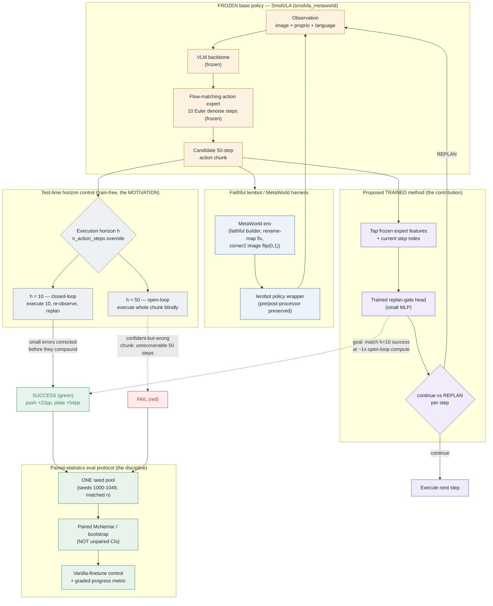

# Horizon — System Architecture

**Closing the loop on a frozen flow-matching VLA.**

Horizon studies a single, verified finding: SmolVLA executes 50-step action
chunks **open-loop**, and shrinking the execution horizon (replanning more often,
i.e. *closing the loop*) yields a large paired success gain. This document maps
the whole system — the frozen base policy, the faithful lerobot/MetaWorld
harness, the test-time horizon control that produced the headline number, the
proposed *trained* replan-gate that aims to recover that gain at ~1x compute, and
the paired-statistics evaluation protocol that keeps every claim honest.

## System flowchart

## Block-by-block explanation

### Frozen base policy — SmolVLA
The base is the public `smolvla_metaworld` checkpoint, used **frozen** end to
end. A VLM backbone consumes the observation (camera image + proprioception +
language instruction) and conditions a **flow-matching action expert** that runs
10 Euler denoise steps to emit a single **50-step action chunk**. No weights in
this block are ever updated — every Horizon result is reported on top of these
exact frozen weights, which is what makes the gains attributable to the
execution loop (and later the gate) rather than to retraining the policy.

### Faithful lerobot / MetaWorld harness
This is the substrate that makes the numbers trustworthy. It builds the
MetaWorld environment and the lerobot policy wrapper *faithfully* — preserving
lerobot's pre/post-processors, applying the dataset rename-map fix, and using the
correct `corner2` image transform (`flip(0,1)`, not a naive `flipud`). Faithful
replay is the reason the base survey lands in a measurable mid-band
(drawer-open 67%, push 58%, window-open 50%, plate-slide 47%, peg-insert 40%)
instead of a floored artifact; reach-v3 (28%) is a floored outlier and is *not*
used as the anchor task.

### Test-time horizon control (the motivation)
The single knob that produced the headline finding. The harness exposes an
`n_action_steps` override = the **execution horizon h**. At `h=50` the policy is
open-loop: it commits the full 50-step chunk and never re-observes, so a
confident-but-wrong chunk drifts off-target and is unrecoverable for 50 steps
(FAIL). At `h=10` the policy is closed-loop: it executes 10 steps, re-observes,
and replans, correcting small errors before they compound (SUCCESS). The measured
paired gains on the one matched seed pool (n=50): **push-v3 +22pp (56% to 78%,
McNemar p=0.035)** and **plate-slide-v3 +54pp (46% to 100%, McNemar p~1e-8)**,
monotone in horizon. This is train-free and is a *known* knob — replanning more
often is plain receding-horizon / ACT temporal ensembling, and the test-time
chunking literature (BID arXiv:2408.17355, RTC arXiv:2506.07339) already exploits
chunk overlap — costing ~5x inference. It is the **motivation and a positive
preliminary number, not the contribution**.

### Proposed trained method (the contribution)
To recover the closed-loop gain without paying 5x inference, a **small trained
replan-gate head** taps the frozen expert's features (plus the current step
index) and makes a per-step **continue-vs-replan** decision. The frozen stack is
re-run only when the gate fires, far less often than every 10 steps, targeting
`h=10`-level success at roughly **1x open-loop compute**. Only this head is
trainable; the entire SmolVLA stack stays frozen. The honest bar: the learned gate
must **beat fixed-frequency replanning at a matched replan budget** (smarter
*when-to-replan*, not just *more-often*) — the raw closed-loop gain is a known knob,
so a tie with fixed-frequency is a kill. Its novelty is **thin but present**: the
nearest *trained* neighbor is **DCDP (arXiv:2603.01953)**, which trains modules that
*correct the actions* via dynamics features — the gate instead decides *replan
timing*. BID (arXiv:2408.17355) and RTC (arXiv:2506.07339) are *training-free*;
Legato (arXiv:2602.12978) is *training-time* boundary smoothness. Not scooped by
these four (citations verified against live abstracts), but the area is crowded.

### Paired-statistics eval protocol (the discipline)
The guardrail that already caught one of our own false positives. Every
comparison runs on **one shared seed pool** with **matched n**, evaluated with
**paired McNemar / bootstrap tests** (never unpaired overlapping CIs), against a
**vanilla-finetune control**, on a continuous metric (binary success plus graded
progress), and powered to detect the effect (>=5 seed blocks; a +5pp effect needs
~1,400 episodes/arm). This protocol is what falsified the four prior swings
(CASTLE routing, STL-GDPA guidance, NIAC averaging at p=0.885, NIAC dispersion
with no leading signal) and what certifies the open-loop gap as real.
